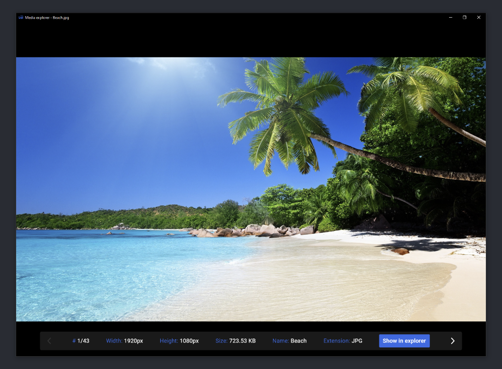

# Media Explorer

A lightweight, fast, and intuitive desktop application for browsing and managing images, videos, and audio files on Windows. Built with Electron and optimized for performance.

## About

**Media Explorer** is designed for users who need a quick, distraction-free way to browse through media collections. Whether you're organizing photos, reviewing video footage, or listening to audio files, Media Explorer provides a clean interface with powerful features to enhance your workflow.

## Key Features

### 📁 Multi-Format Support
- **Image formats**: PNG, JPG, JPEG, WebP, SVG, GIF, BMP, ICO, JFIF, TIFF, RAW
- **Video formats**: MP4, MKV, MOV, AVI, WMV, FLV, WebM
- **Audio formats**: MP3, WAV, OGG

### 🖼️ Image Viewing & Editing
- **Zoom and Pan**: Scroll to zoom in/out with cursor-tracked zoom. Drag to pan around zoomed images, with intelligent boundary constraints
- **Sharp Pixels Toggle**: Switch between smooth interpolation and crisp-edged pixel rendering for pixel art or detailed inspection
- **Flip Horizontally**: Mirror images for viewing from different perspectives
- **Invert Background**: Switch between dark and light backgrounds to better view different image types
- **Reset Button**: Instantly return to default zoom level and position

### 🎬 Video Features
- **Thumbnail Previews**: Automatic thumbnail generation at 3.5 seconds into videos
- **Video Controls**: Full playback controls including play, pause, seek, and volume
- **Format Support**: Play multiple video formats with native HTML5 video player
- **Metadata Display**: View video dimensions and file information in the sidebar

### 🎵 Audio Playback
- Built-in audio player with playback controls
- Support for all major audio formats (MP3, WAV, OGG)
- Responsive audio player interface

### ⌨️ Navigation
- **Arrow Keys**: Navigate between media files in the folder using Left/Right arrow keys
- **Visual Navigation Arrows**: Click on-screen arrows to browse next/previous files
- **Keyboard Shortcuts**: Spacebar, Enter, or Escape to toggle the sidebar for more screen space

### 📊 File Information Sidebar
The sidebar displays detailed information about the current media:
- File location (folder path)
- Position in folder (e.g., "5 / 42")
- Image/video dimensions (width × height in pixels)
- Human-readable file size (KB, MB, GB with thousand separators)
- Exact file size in bytes
- Full filename
- File extension

### ⚡ Performance Optimizations
- Intelligent preloading of next/previous media files
- Smooth 0.15s sidebar animations
- Optimized opacity transitions for UI elements
- Lazy thumbnail generation to prevent startup delays
- Efficient memory management with bounded preload cache

### 🔧 Open With Integration
- "Open With" dialog to launch media files with other applications
- Direct system integration with Windows file handlers

### 💾 File System Integration
- "Show in Explorer" button to reveal files in Windows File Explorer
- Direct access to file locations for easy organization

### 🎨 User Experience
- **Dark Theme**: Easy on the eyes, perfect for media review sessions
- **Minimal Interface**: Focus on content, not clutter
- **Responsive Design**: Adapts to different screen sizes and resolutions
- **Smooth Animations**: Polished transitions and interactions
- **Centered Layout**: Media displays optimally centered regardless of window size

## System Requirements

- **OS**: Windows 11 (or Windows 10)
- **RAM**: 512 MB minimum
- **Disk Space**: ~200 MB for installation

## Installation

Download and run the latest installer: `Media explorer installer.exe`

The installer will:
- Install the application to `%LocalAppData%\Programs\mediaexplorer\`
- Create Start Menu and Desktop shortcuts
- Register Media Explorer as the default application for supported media file types

## Getting Started

1. **Open a media file** from Windows File Explorer - right-click and select "Open with" → Media Explorer
2. **Browse files** using arrow keys or on-screen navigation arrows
3. **Toggle the sidebar** with Spacebar, Enter, or Escape for full-screen viewing
4. **Adjust image display** using zoom, pan, flip, or background inversion options
5. **View file details** in the sidebar while browsing through your collection

## Keyboard Shortcuts

| Shortcut | Action |
|----------|--------|
| Left Arrow | Navigate to previous media file |
| Right Arrow | Navigate to next media file |
| Spacebar / Enter / Escape | Toggle sidebar for full-screen view |
| Mouse Wheel | Zoom in/out on images |
| Drag | Pan around zoomed images |

## Why Use Media Explorer?

- **Fast Startup**: Optimized for quick launching and instant media viewing
- **Smooth Performance**: Efficient rendering and intelligent preloading
- **Intuitive Controls**: Familiar keyboard and mouse interactions
- **Comprehensive Format Coverage**: One app for images, videos, and audio
- **Distraction-Free**: Clean interface focused entirely on media content
- **Deep Windows Integration**: Native file associations for seamless opening
- **Detailed File Information**: View all file metadata at a glance

## Technologies

- **Electron** 40.2.1 - Cross-platform desktop framework
- **JavaScript (ES6+)** - Application logic with ES modules
- **HTML5 & CSS3** - User interface and styling
- **Node.js** - System integration and file operations
- **electron-builder** - Installation and packaging

## File Association

Media Explorer is automatically registered for common media formats upon installation. Supported file types include:
- **Images**: PNG, JPG, JPEG, WebP, SVG, GIF, BMP, ICO, JFIF, TIFF, RAW
- **Videos**: MP4, MKV, MOV, AVI, WMV, FLV, WebM
- **Audio**: MP3, WAV, OGG

If you need to change default apps, go to **Windows Settings → Default apps** and search for specific file types.

---

**Version**: 1.0.1  
**Author**: Kris  
**License**: MIT  
**Last Updated**: February 2026
